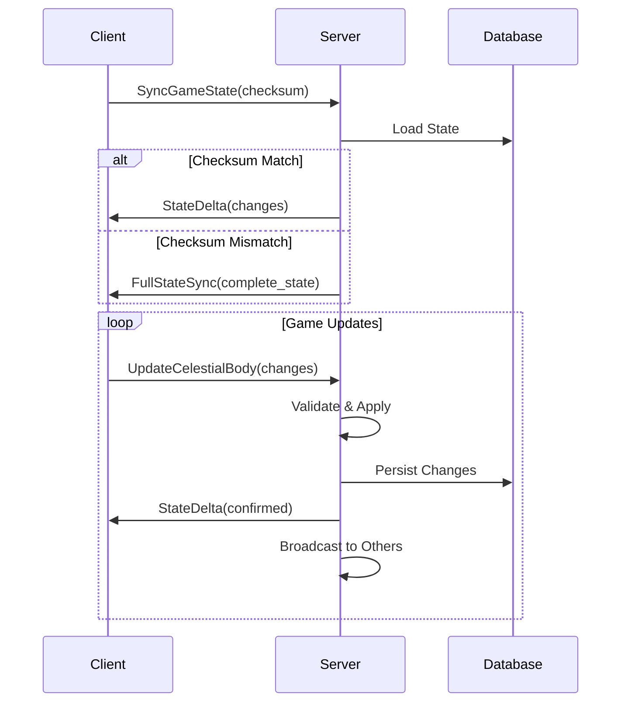

# Cosmic Gardener WebSocket Protocol Documentation

## 概要

Cosmic GardenerのWebSocketプロトコルは、リアルタイムなゲーム状態同期とスケーラブルな通信を実現するために設計されています。Actix-WebとMessagePack/JSONのハイブリッド形式を採用し、低レイテンシかつ効率的な双方向通信を提供します。

## アーキテクチャ

### 技術スタック
- **WebSocketフレームワーク**: Actix-WS (Actix-Web-Actors)
- **シリアライゼーション**: JSON（開発）/ MessagePack（本番）
- **圧縮**: LZ4（低レイテンシ）、Zstd（バランス）、Brotli（高圧縮）
- **認証**: JWT (RS256)

### コンポーネント構成

```
┌─────────────────────────────────────────────────┐
│                   Client                        │
├─────────────────────────────────────────────────┤
│            WebSocket Connection                 │
├─────────────────────────────────────────────────┤
│              Message Protocol                   │
│         (JSON/MessagePack + Compression)        │
├─────────────────────────────────────────────────┤
│            WebSocket Handler                    │
│      (Authentication & Session Management)      │
├─────────────────────────────────────────────────┤
│          State Synchronization Engine           │
│        (Delta Tracking & Conflict Resolution)   │
├─────────────────────────────────────────────────┤
│           Bandwidth Optimization                │
│    (View Culling & Delta Encoding & Compression)│
├─────────────────────────────────────────────────┤
│            Backpressure Management              │
│         (Rate Limiting & Queue Control)         │
└─────────────────────────────────────────────────┘
```

## メッセージプロトコル

### メッセージタイプ

#### クライアント → サーバー

1. **Authenticate** - 認証リクエスト
```rust
{
  "type": "Authenticate",
  "data": {
    "access_token": "JWT_TOKEN",
    "device_id": "DEVICE_UUID",
    "client_version": "1.0.0"
  }
}
```

2. **SyncGameState** - ゲーム状態同期リクエスト
```rust
{
  "type": "SyncGameState",
  "data": {
    "save_id": "UUID",
    "last_sync_timestamp": "2024-01-08T10:00:00Z",
    "client_checksum": "SHA256_HASH"
  }
}
```

3. **CreateCelestialBody** - 天体作成
```rust
{
  "type": "CreateCelestialBody",
  "data": {
    "parent_id": "UUID",
    "body_type": "Planet",
    "position": { "x": 100.0, "y": 200.0, "z": 0.0 },
    "velocity": { "vx": 0.0, "vy": 10.0, "vz": 0.0 },
    "name": "Earth"
  }
}
```

4. **UpdateCelestialBody** - 天体更新
```rust
{
  "type": "UpdateCelestialBody",
  "data": {
    "id": "UUID",
    "updates": {
      "position": { "x": 150.0, "y": 250.0, "z": 0.0 },
      "level": 2
    },
    "timestamp": "2024-01-08T10:00:00Z"
  }
}
```

5. **Heartbeat** - ハートビート
```rust
{
  "type": "Heartbeat",
  "data": {
    "sequence": 12345,
    "timestamp": "2024-01-08T10:00:00Z"
  }
}
```

#### サーバー → クライアント

1. **AuthenticateResponse** - 認証応答
```rust
{
  "type": "AuthenticateResponse",
  "data": {
    "success": true,
    "user_id": "UUID",
    "session_id": "UUID",
    "error": null
  }
}
```

2. **FullStateSync** - 完全状態同期
```rust
{
  "type": "FullStateSync",
  "data": {
    "save_id": "UUID",
    "timestamp": "2024-01-08T10:00:00Z",
    "resources": {
      "cosmic_dust": 1000.0,
      "energy": 500.0,
      "organic_matter": 100.0,
      "biomass": 50.0,
      "dark_matter": 10.0,
      "thought_points": 5.0
    },
    "celestial_bodies": [...],
    "research": {...},
    "statistics": {...},
    "server_checksum": "SHA256_HASH"
  }
}
```

3. **StateDelta** - 差分更新
```rust
{
  "type": "StateDelta",
  "data": {
    "timestamp": "2024-01-08T10:00:00Z",
    "sequence_number": 12345,
    "deltas": [
      {
        "delta_type": "CelestialBodyUpdated",
        "id": "UUID",
        "updates": {
          "position": { "x": 200.0, "y": 300.0, "z": 0.0 }
        }
      }
    ]
  }
}
```

4. **Error** - エラー通知
```rust
{
  "type": "Error",
  "data": {
    "code": "WS_SYNC_001",
    "message": "同期コンフリクトが発生しました",
    "details": {},
    "recoverable": true
  }
}
```

## 状態同期アルゴリズム

### 差分同期の仕組み

1. **チェックサム検証**
   - クライアントとサーバーが状態のチェックサムを比較
   - 一致した場合は差分のみを送信
   - 不一致の場合は完全同期を実行

2. **オペレーショナル変換**
   - バージョンベクトルによる同時編集の追跡
   - コンフリクト発生時はサーバー権威で解決

3. **優先度付きキュー**
   - Critical: プレイヤーの直接操作
   - High: 視界内の重要な更新
   - Normal: 通常の状態更新
   - Low: バックグラウンド同期

### 同期フロー



## 帯域幅最適化

### 1. デルタエンコーディング

位置と速度の差分を量子化して送信：

```rust
// 位置差分（メートル → ミリメートル、16bit整数）
PositionDelta {
    dx: -32768 to 32767 mm,
    dy: -32768 to 32767 mm,
    dz: -32768 to 32767 mm
}

// 速度差分（m/s → mm/s、16bit整数）
VelocityDelta {
    dvx: -32768 to 32767 mm/s,
    dvy: -32768 to 32767 mm/s,
    dvz: -32768 to 32767 mm/s
}
```

### 2. ビューカリング

プレイヤーの視界外の天体を除外：

- **視界距離**: 10km
- **LODレベル**:
  - Full (< 100m): 完全詳細
  - Medium (< 500m): 中詳細
  - Low (< 2km): 低詳細
  - Minimal (< 5km): 最小情報

### 3. 動的圧縮

帯域幅とレイテンシに基づいて圧縮アルゴリズムを選択：

- **低帯域幅 (< 500kbps)**: Brotli（高圧縮）
- **高レイテンシ (> 100ms)**: Zstd（バランス）
- **通常**: LZ4（低レイテンシ）

## バックプレッシャー管理

### 戦略

1. **DropOldest**: 古いメッセージを削除（重要メッセージは保持）
2. **RateLimit**: 送信レートを制限（Token Bucketアルゴリズム）
3. **Coalesce**: 類似メッセージを結合
4. **Adaptive**: キュー使用率に基づいて動的調整

### フロー制御

```rust
キュー使用率 < 50%: 通常送信
キュー使用率 50-80%: レート制限
キュー使用率 > 80%: メッセージ結合
キュー使用率 > 90%: 非重要メッセージをドロップ
```

## ハートビート

### 設定

- **間隔**: 30秒（デフォルト）
- **タイムアウト**: 60秒
- **最大失敗回数**: 3回

### アダプティブ調整

レイテンシに基づいて間隔を自動調整：

- 低レイテンシ (< 100ms): 20秒
- 通常 (100-500ms): 30秒
- 高レイテンシ (> 500ms): 45秒

## エラーハンドリング

### エラーコード体系

- **WS_AUTH_xxx**: 認証エラー
- **WS_SYNC_xxx**: 同期エラー
- **WS_RATE_xxx**: レート制限エラー
- **WS_PROTO_xxx**: プロトコルエラー
- **WS_GAME_xxx**: ゲームロジックエラー
- **WS_CONN_xxx**: 接続エラー

### リトライ戦略

指数バックオフ with ジッター：

```rust
初回: 1秒
2回目: 2秒 ± 10%
3回目: 4秒 ± 10%
最大: 30秒
```

## セキュリティ

### 認証

- JWT (RS256) による認証
- デバイスIDによるセッション管理
- 自動トークンローテーション

### レート制限

- 認証前: 5 req/min
- 認証後: 60 msg/sec
- バースト: 10メッセージ

### データ検証

- 全入力データのバリデーション
- チェックサムによる整合性検証
- 物理法則違反の検出

## パフォーマンス目標

- **レイテンシ**: < 50ms（国内）
- **スループット**: 1000 msg/sec/connection
- **同時接続数**: 10,000 connections/server
- **CPU使用率**: < 80%
- **メモリ使用量**: < 4GB

## クライアント実装例

### TypeScript/JavaScript

```typescript
class CosmicGardenerWebSocket {
  private ws: WebSocket;
  private heartbeatInterval: number;
  private reconnectAttempts = 0;

  constructor(private url: string, private token: string) {}

  connect() {
    this.ws = new WebSocket(this.url);
    
    this.ws.onopen = () => {
      this.authenticate();
      this.startHeartbeat();
    };

    this.ws.onmessage = (event) => {
      const message = JSON.parse(event.data);
      this.handleMessage(message);
    };

    this.ws.onerror = (error) => {
      console.error('WebSocket error:', error);
      this.reconnect();
    };
  }

  private authenticate() {
    this.send({
      type: 'Authenticate',
      data: {
        access_token: this.token,
        device_id: this.getDeviceId(),
        client_version: '1.0.0'
      }
    });
  }

  private handleMessage(message: WsMessage) {
    switch (message.type) {
      case 'AuthenticateResponse':
        if (message.data.success) {
          this.onAuthenticated();
        }
        break;
      case 'StateDelta':
        this.applyStateDelta(message.data);
        break;
      // ... other message types
    }
  }
}