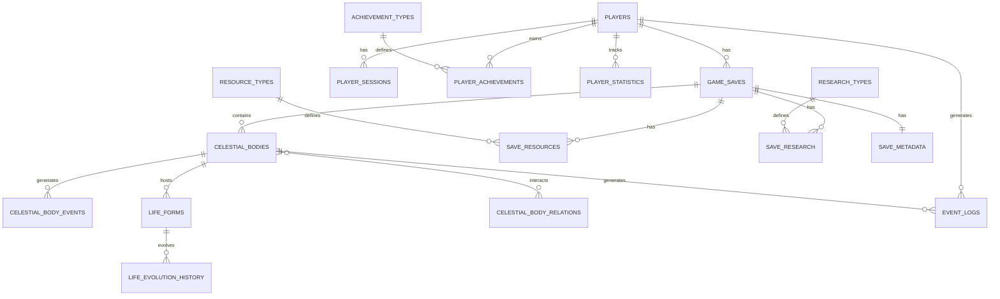

# Cosmic Gardener データベース ERD（Entity Relationship Diagram）

## 概要

本ERDは、Cosmic Gardenerのバックエンドデータベース構造を定義します。
設計原則：
- 大量の天体データの効率的な格納
- 頻繁な更新に対する最適化
- 水平スケーリングを考慮した設計
- PostGISによる空間データの最適化

## エンティティ関連図

## 主要エンティティ

### 1. プレイヤー関連

#### PLAYERS（プレイヤー）
- ユーザー認証と基本情報を管理
- 関係：複数のセーブデータ、セッション、実績を持つ

#### PLAYER_SESSIONS（プレイヤーセッション）
- ログイン履歴とセッション管理
- チート検出のためのセッション追跡

#### PLAYER_ACHIEVEMENTS（プレイヤー実績）
- 獲得した実績の記録
- タイムスタンプ付きで進捗を追跡

#### PLAYER_STATISTICS（プレイヤー統計）
- 総プレイ時間、作成天体数などの累積統計
- 分析とランキング用データ

### 2. セーブデータ関連

#### GAME_SAVES（ゲームセーブ）
- プレイヤーのゲーム状態のスナップショット
- バージョン管理と圧縮対応

#### SAVE_METADATA（セーブメタデータ）
- セーブデータのメタ情報（バージョン、作成日時等）
- 互換性チェック用

#### SAVE_RESOURCES（保存リソース）
- 各セーブデータのリソース状態
- 6種類のリソース量を記録

#### SAVE_RESEARCH（保存研究）
- 研究進捗状態
- アンロック済み機能の記録

### 3. 天体関連

#### CELESTIAL_BODIES（天体）
- 全ての天体オブジェクトの基本情報
- PostGISのGEOMETRY型で3D座標を管理
- 物理パラメータ（質量、速度、回転等）

#### CELESTIAL_BODY_RELATIONS（天体関係）
- 天体間の相互作用（軌道関係、重力影響等）
- 自己参照による階層構造

#### CELESTIAL_BODY_EVENTS（天体イベント）
- 天体で発生したイベントの記録
- 超新星爆発、生命誕生等

### 4. 生命関連

#### LIFE_FORMS（生命体）
- 天体上の生命の状態
- 進化段階（微生物→植物→動物→知的生命体）

#### LIFE_EVOLUTION_HISTORY（生命進化履歴）
- 生命の進化過程の記録
- 研究用データとして活用

### 5. イベントログ

#### EVENT_LOGS（イベントログ）
- 全てのゲームイベントの記録
- 分析とデバッグ用
- パーティショニング対象

### 6. マスターデータ

#### RESOURCE_TYPES（リソース種別）
- リソースの定義マスター

#### RESEARCH_TYPES（研究種別）
- 研究項目の定義マスター

#### ACHIEVEMENT_TYPES（実績種別）
- 実績の定義マスター

## データ分割戦略

### 1. 垂直分割
- 頻繁にアクセスされるホットデータ（現在のゲーム状態）
- コールドデータ（過去のセーブ、イベントログ）

### 2. 水平分割（シャーディング）
- プレイヤーIDによるシャーディング
- リージョンベースの分割（将来対応）

### 3. 時系列分割
- EVENT_LOGSは月別パーティショニング
- 古いログは自動アーカイブ

## 特殊考慮事項

### 1. 大量天体データの最適化
- 空間インデックス（R-Tree）の活用
- 天体の階層的クラスタリング
- LOD（Level of Detail）による段階的読み込み

### 2. リアルタイム更新対応
- 楽観的ロックによる並行制御
- 差分更新によるネットワーク負荷軽減
- Redisキャッシュとの連携

### 3. スケーラビリティ
- Read Replicaによる読み取り負荷分散
- 非同期書き込みキューの実装
- マイクロバッチによる一括更新