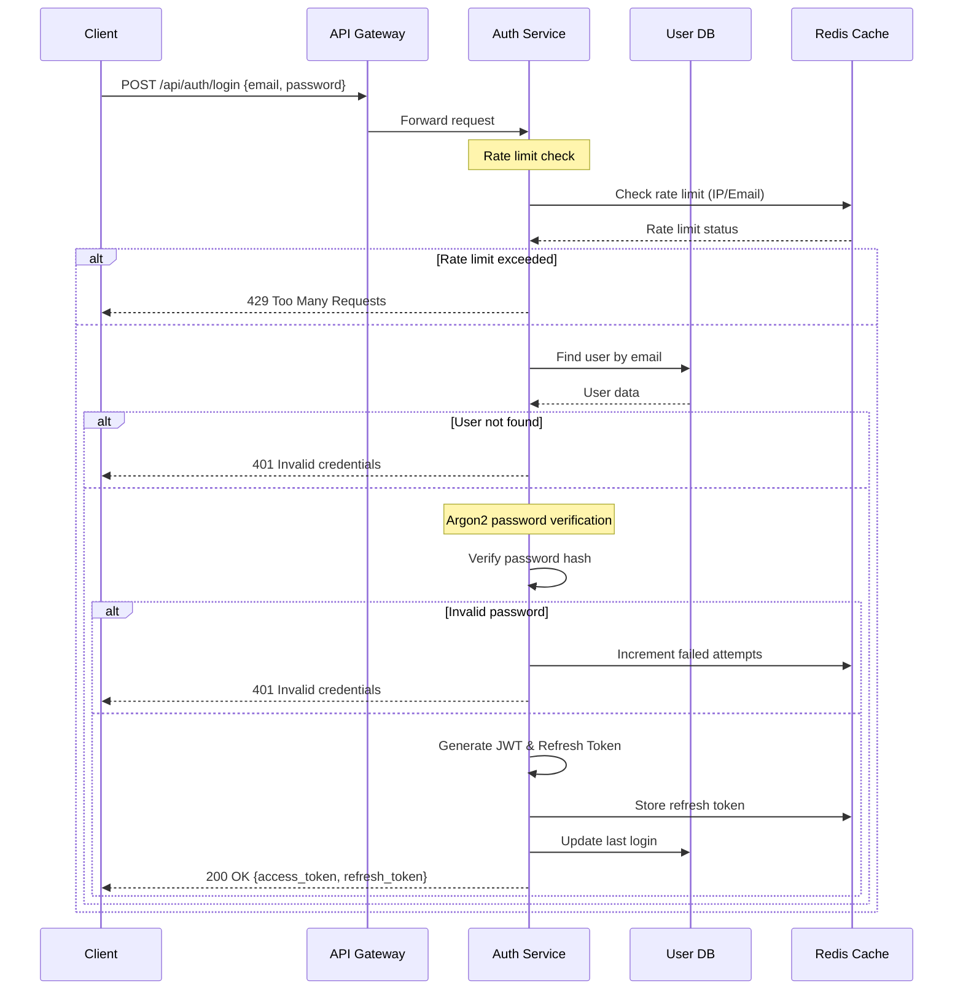
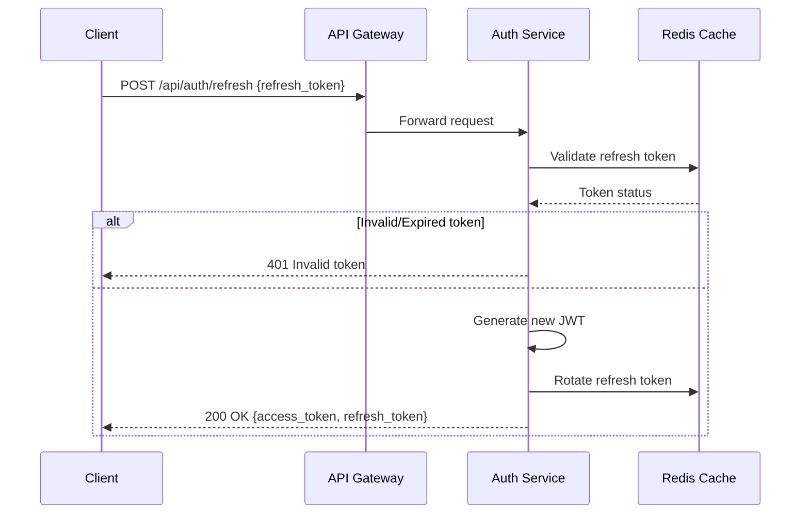
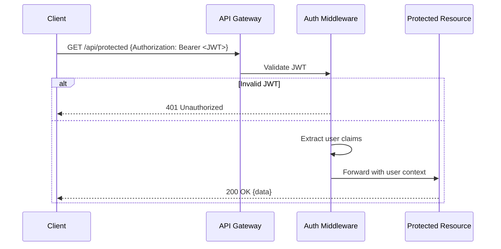

# Cosmic Gardener 認証システム設計書

## 1. 認証フローのシーケンス図

### 1.1 ログインフロー



### 1.2 トークンリフレッシュフロー



### 1.3 リクエスト認証フロー



## 2. JWT構造とクレーム設計

### 2.1 アクセストークン構造

```json
{
  "header": {
    "alg": "RS256",
    "typ": "JWT",
    "kid": "2024-01-key-id"
  },
  "payload": {
    "sub": "user_uuid",
    "iat": 1704067200,
    "exp": 1704070800,  // 1時間後
    "nbf": 1704067200,
    "jti": "unique_token_id",
    "iss": "cosmic-gardener-api",
    "aud": ["cosmic-gardener-web", "cosmic-gardener-mobile"],
    "user": {
      "id": "user_uuid",
      "email": "user@example.com",
      "username": "cosmic_player",
      "roles": ["player", "premium"],
      "permissions": ["game:play", "stats:view", "save:write"]
    },
    "session": {
      "id": "session_uuid",
      "ip": "hashed_ip",
      "device_id": "device_fingerprint"
    }
  }
}
```

### 2.2 リフレッシュトークン構造

```json
{
  "payload": {
    "sub": "user_uuid",
    "iat": 1704067200,
    "exp": 1706659200,  // 30日後
    "jti": "refresh_token_id",
    "token_family": "family_id",  // トークンローテーション用
    "session_id": "session_uuid"
  }
}
```

### 2.3 トークン有効期限戦略

| トークンタイプ | 有効期限 | 更新ポリシー |
|------------|---------|-----------|
| アクセストークン | 1時間 | リフレッシュトークンで更新 |
| リフレッシュトークン | 30日 | 使用時に自動ローテーション |
| セッション | 7日（アクティブ時） | 最終アクセスから延長 |
| API Key（将来） | 無期限 | 手動無効化のみ |

## 3. セキュリティ考慮事項

### 3.1 一般的なセキュリティ対策

1. **HTTPS必須**
   - 全API通信でTLS 1.3以上を強制
   - HTTP Strict Transport Security (HSTS) ヘッダーの設定

2. **トークン保存**
   - アクセストークン: メモリのみ（SessionStorage避ける）
   - リフレッシュトークン: HttpOnly, Secure, SameSite=Strict Cookie

3. **入力検証**
   - メールアドレス: RFC 5322準拠の検証
   - パスワード: 最小12文字、複雑性要件

4. **レスポンスヘッダー**
   ```
   X-Content-Type-Options: nosniff
   X-Frame-Options: DENY
   X-XSS-Protection: 1; mode=block
   Content-Security-Policy: default-src 'self'
   ```

### 3.2 監査とロギング

1. **認証イベントログ**
   - ログイン成功/失敗
   - トークンリフレッシュ
   - パスワード変更
   - 異常なアクセスパターン

2. **保持期間**
   - セキュリティログ: 90日
   - アクセスログ: 30日

## 4. Actix Webミドルウェア設計

### 4.1 認証ミドルウェアインターフェース

```rust
// src/middleware/auth.rs
use actix_web::{dev::ServiceRequest, Error, HttpMessage};
use actix_web_httpauth::extractors::bearer::BearerAuth;

pub struct AuthMiddleware {
    jwt_validator: Arc<JwtValidator>,
    redis_client: Arc<RedisClient>,
}

impl AuthMiddleware {
    pub async fn from_request(
        req: &ServiceRequest,
        credentials: BearerAuth,
    ) -> Result<AuthenticatedUser, Error> {
        let token = credentials.token();
        
        // JWT検証
        let claims = self.jwt_validator
            .validate(token)
            .await
            .map_err(|_| ErrorUnauthorized("Invalid token"))?;
        
        // ブラックリストチェック
        if self.redis_client.is_blacklisted(token).await? {
            return Err(ErrorUnauthorized("Token revoked"));
        }
        
        // ユーザーコンテキストの設定
        let user = AuthenticatedUser::from_claims(claims);
        req.extensions_mut().insert(user.clone());
        
        Ok(user)
    }
}

// 認証ユーザー構造体
#[derive(Clone, Debug)]
pub struct AuthenticatedUser {
    pub id: Uuid,
    pub email: String,
    pub username: String,
    pub roles: Vec<String>,
    pub permissions: Vec<String>,
    pub session_id: Uuid,
}

// 権限チェック用トレイト
pub trait RequirePermission {
    fn require(&self, permission: &str) -> Result<(), Error>;
    fn require_any(&self, permissions: &[&str]) -> Result<(), Error>;
    fn require_all(&self, permissions: &[&str]) -> Result<(), Error>;
}
```

### 4.2 レート制限ミドルウェア

```rust
// src/middleware/rate_limit.rs
pub struct RateLimitMiddleware {
    redis_client: Arc<RedisClient>,
    limits: HashMap<String, RateLimit>,
}

#[derive(Clone)]
pub struct RateLimit {
    pub requests: u32,
    pub window: Duration,
    pub block_duration: Duration,
}

impl RateLimitMiddleware {
    pub async fn check_limit(
        &self,
        key: &str,
        limit_type: &str,
    ) -> Result<(), Error> {
        let limit = self.limits
            .get(limit_type)
            .ok_or_else(|| ErrorInternalServerError("Unknown limit type"))?;
        
        let current = self.redis_client
            .increment_with_expiry(key, limit.window)
            .await?;
        
        if current > limit.requests {
            // ブロック期間の設定
            self.redis_client
                .set_with_expiry(
                    &format!("blocked:{}", key),
                    "1",
                    limit.block_duration,
                )
                .await?;
            
            return Err(ErrorTooManyRequests("Rate limit exceeded"));
        }
        
        Ok(())
    }
}
```

## 5. セキュリティ対策の詳細

### 5.1 ブルートフォース攻撃対策

1. **プログレッシブ遅延**
   ```rust
   失敗回数 | 遅延時間
   ---------|----------
   1-2     | 0秒
   3-5     | 2秒
   6-10    | 5秒
   11-20   | 30秒
   21+     | アカウント一時ロック（15分）
   ```

2. **IPベースの制限**
   - 同一IPから: 10回/分、100回/時、1000回/日
   - 失敗時: 次回試行まで指数関数的遅延

3. **CAPTCHA統合**
   - 3回失敗後: reCAPTCHA v3要求
   - スコア閾値: 0.5以上

### 5.2 トークン盗難時の対策

1. **トークンファミリー**
   - リフレッシュトークン使用時に全ファミリー無効化
   - 不正使用検出時に全セッション終了

2. **デバイスフィンガープリント**
   - User-Agent、画面解像度、タイムゾーン等でハッシュ生成
   - 変更検出時に再認証要求

3. **異常検出**
   - 地理的に離れた場所からの同時アクセス
   - 短時間での多数のAPIコール
   - 異なるIPからの頻繁なトークンリフレッシュ

### 5.3 CSRF対策

1. **Double Submit Cookie**
   - CSRFトークンをCookieとヘッダーの両方で送信
   - サーバー側で一致を検証

2. **SameSite Cookie属性**
   - 全認証関連CookieにSameSite=Strict設定

3. **Origin/Refererチェック**
   - 状態変更操作時にOriginヘッダー検証

### 5.4 タイミング攻撃対策

1. **一定時間レスポンス**
   ```rust
   async fn login_handler() -> Result<HttpResponse> {
       let start = Instant::now();
       let result = authenticate_user().await;
       
       // 最小500msのレスポンス時間を保証
       let elapsed = start.elapsed();
       if elapsed < Duration::from_millis(500) {
           sleep(Duration::from_millis(500) - elapsed).await;
       }
       
       result
   }
   ```

2. **Argon2パラメータ**
   ```rust
   Argon2::new(
       Algorithm::Argon2id,
       Version::V0x13,
       Params::new(
           65536,  // メモリコスト: 64MB
           3,      // イテレーション
           4,      // 並列度
           None
       )?
   )
   ```

### 5.5 パスワードポリシー

1. **要件**
   - 最小長: 12文字
   - 最大長: 128文字
   - 文字種: 大文字、小文字、数字、記号から3種以上

2. **ブラックリスト**
   - 一般的なパスワード上位10,000件
   - ユーザー名、メールアドレスの部分文字列
   - 連続文字、反復パターン

3. **履歴チェック**
   - 過去5世代のパスワードハッシュと比較
   - bcryptで別途ハッシュ化して保存

4. **強度メーター**
   - zxcvbnライブラリで評価
   - エントロピー計算でスコア表示

## 6. エラーハンドリング

### 6.1 エラーレスポンス形式

```json
{
  "error": {
    "code": "AUTH_INVALID_CREDENTIALS",
    "message": "Invalid email or password",
    "timestamp": "2024-01-01T00:00:00Z",
    "request_id": "req_abc123",
    "details": {
      "attempts_remaining": 2
    }
  }
}
```

### 6.2 エラーコード体系

| コード | HTTP Status | 説明 |
|-------|------------|-----|
| AUTH_INVALID_CREDENTIALS | 401 | 認証情報が無効 |
| AUTH_TOKEN_EXPIRED | 401 | トークン期限切れ |
| AUTH_TOKEN_INVALID | 401 | トークン形式不正 |
| AUTH_INSUFFICIENT_PERMISSION | 403 | 権限不足 |
| AUTH_RATE_LIMITED | 429 | レート制限超過 |
| AUTH_ACCOUNT_LOCKED | 423 | アカウントロック中 |

## 7. 将来的なOAuth対応

### 7.1 対応プロバイダー
- Google (OAuth 2.0)
- Discord (OAuth 2.0)
- Steam (OpenID)

### 7.2 実装方針
1. アカウントリンク機能
2. 初回ログイン時のユーザー名設定
3. 複数プロバイダーの統合管理

### 7.3 データベース設計考慮
```sql
-- OAuth連携用テーブル
CREATE TABLE oauth_connections (
    id UUID PRIMARY KEY,
    user_id UUID REFERENCES users(id),
    provider VARCHAR(50) NOT NULL,
    provider_user_id VARCHAR(255) NOT NULL,
    access_token TEXT,
    refresh_token TEXT,
    expires_at TIMESTAMP,
    created_at TIMESTAMP DEFAULT CURRENT_TIMESTAMP,
    UNIQUE(provider, provider_user_id)
);
```